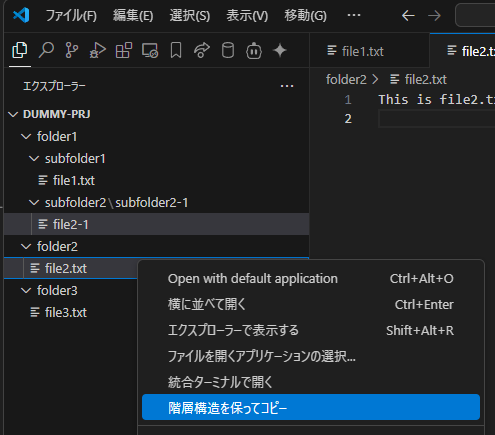

# file-tree-exporter
### 階層構造維持型ファイルコピー

本拡張機能は、VSCode上で選択されたファイルを、元のディレクトリ構造を保持したまま指定の出力先へコピーする機能を提供します。大規模プロジェクトにおけるファイル共有や、閉鎖的なイントラネット環境での作業において、ディレクトリ構造を維持したまま特定のファイル群をエクスポートするニーズに応えます。

## 主な機能

* 選択されたファイルのディレクトリ構造を再帰的に解析し、出力先へ再現
* 閉鎖的イントラネット環境でのファイル受け渡しの簡素化
* 手動でのファイルコピーによるヒューマンエラーの削減

ソースコード管理システムを利用しつつ、特定のファイル群を外部へ提供する必要がある技術者のワークフローを支援します。

## 使い方

1. VSCodeのファイルエクスプローラーで、コピーしたいファイルやフォルダを選択します
2. 選択したアイテムを右クリックして表示されるコンテキストメニューから「階層構造を保ってコピー」を選択します
   
3. ダイアログが表示されたら、出力先フォルダを選択します
4. 選択したファイルがディレクトリ構造を維持したまま出力先へコピーされます
